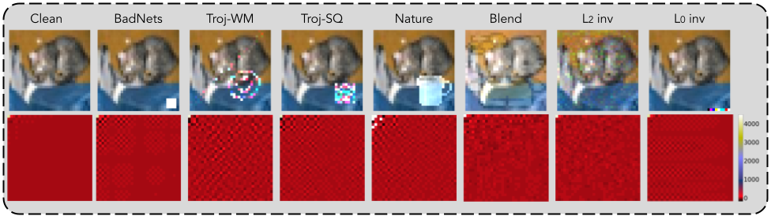
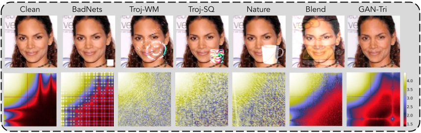
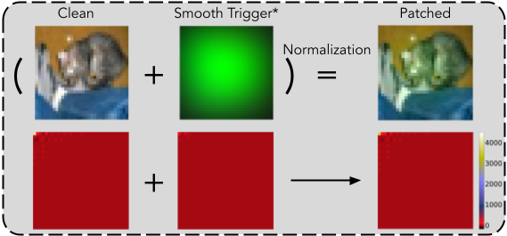
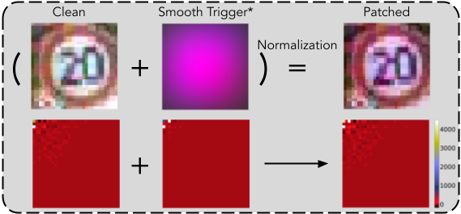

# Rethinking the Backdoor Attacks' Triggers: A Frequency Perspective
This is the official implementation of the ICCV paper: 'Rethinking the Backdoor Attacks' Triggers: A Frequency Perspective .' 

Backdoor attacks have been considered a severe security threat to deep learning. Such attacks can make models perform abnormally on inputs with predefined triggers and still retain state-of-the-art performance on clean data. While backdoor attacks have been thoroughly investigated in the image domain from both attackers' and defenders' sides, an analysis in the frequency domain has been missing thus far.

We find most existing triggers of backdoor attacks in deep learning contain severe artifacts in the frequency domain. This implementation includes: 1) a sample of developing a supervised backdoored data detector in the frequency domain, which achieves an averaging 98.50% detection rate under attack and model agnostic settings over eight different backdoor attacks (Sec_4); 2) the code for a frequency invisible backdoor attack, termed smooth attack (Sec_5). Details are included under each folder.

In short, our work emphasizes the importance of considering frequency analysis when designing both backdoor attacks and defenses in deep learning.

# Requirments
tensorflow == 1.15.0;  
pytorch == 1.4.0; 
albumentations == 0.4.5; 
tqdm; 
numpy; 
cv2; 

# Usage
We provide the code of **training and testing a frequency-based backdoor detector** and the code of **generating low-frequency constraint trigger given a pre-trained model**.

# Frequency Artifacts Examples

# Smooth Attack's Examples

